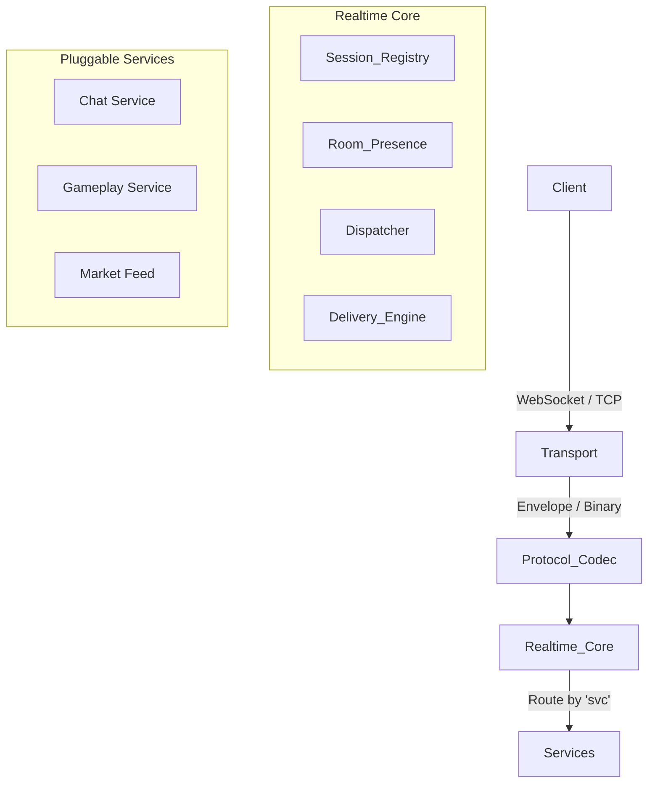

<div align="center">


# wsPrism

**A High-Performance, Low-Latency Realtime Socket Framework for Rust**

[](https://opensource.org/licenses/MIT)
[](https://opensource.org/licenses/Apache-2.0)
[](https://www.rust-lang.org)

</div>

---

## 📖 Introduction

**wsPrism** is a realtime gateway framework written in Rust, designed for systems where milliseconds matter — such as **multiplayer games, real-time trading, collaborative platforms, and live control systems**.

Unlike traditional WebSocket frameworks that focus on convenience or general web messaging, wsPrism is built as a **dedicated realtime gateway**. It is a core designed to route, prioritize, and deliver messages with minimal overhead, while remaining extensible across multiple domain-specific services.

## ❓ Why wsPrism?

Modern realtime applications often require a hybrid approach:

* **Human-scale messaging:** Chat, presence, notifications (Latency tolerant)
* **Machine-scale signaling:** Game inputs, market data, control signals (Latency critical)

Most frameworks optimize for only one. **wsPrism** is designed to handle **both** in a single, unified architecture.

### Core Goals

* ⚡ **Ultra-low latency** message handling
* 🧠 **Deterministic behavior** under high load
* 🧩 **Composable services** (Chat, Gameplay, Trading, etc.)
* 🔌 **Transport-agnostic** core design
* 📦 **Binary-first**, JSON-friendly protocol
* 🦀 **Rust safety** without sacrificing performance

---

## 🏗 Key Design Principles

### 1. Transport is not the Business Logic
wsPrism enforces a clean separation of concerns:
* **Transport Layer:** WebSocket, TCP, or future QUIC implementations.
* **Realtime Core:** Manages sessions, routing, rooms, and message delivery.
* **Services:** Pure domain logic (e.g., chat rules, game physics, market feeds).

This prevents protocol details from leaking into domain logic and enables code reuse across multiple realtime services.

### 2. Message Routing via Unified Envelope
All inbound messages are wrapped in a minimal `Envelope` structure. This allows a single connection to multiplex chat, gameplay, and control traffic safely.

```json
{
  "svc": "game",
  "type": "input",
  "room": "match:42",
  "data": { ... }
}
```

### 3. Binary-First for Extreme Latency Paths
wsPrism treats binary messages as first-class citizens.
* **Chat / UI Events:** JSON (Text frames) for ease of development.
* **Game Input / Signals:** Compact binary frames for performance.

**Binary Helpers** are included to minimize allocations, avoid parsing overhead, and support fixed-layout packets (e.g., bitmasks, sequence numbers).

### 4. Deterministic Backpressure & Prioritization
Realtime systems fail due to **tail latency**, not average latency. wsPrism is designed to support:
* **Per-session outbound queues** with priority separation (e.g., `Gameplay > Chat`).
* **"Latest-state-wins"** semantics for input handling.
* **Hard payload size limits** to prevent slow consumers from stalling critical paths.

### 5. Service-Oriented Realtime Architecture
Each realtime feature is implemented as an independent **Service Plugin**:
* Chat Service
* Gameplay Input Service
* Party / Room Service
* Market Data Feed

Services depend only on the **Realtime Core API**, not on WebSocket or HTTP specifics. This enables independent evolution, easier testing, and clear ownership boundaries.

---

## 📐 Architecture Overview


