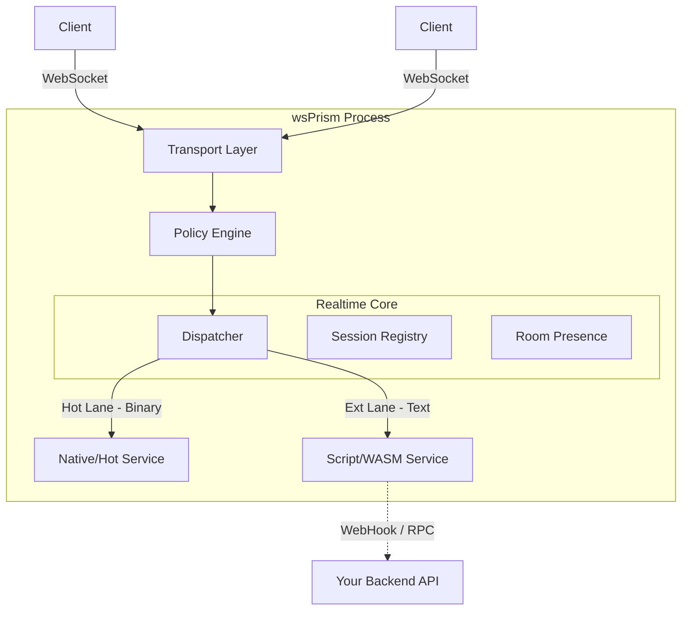

<div align="center">


# wsPrism

**The Enterprise-Grade Realtime Gateway**

**Native Performance. Universal Extensibility.**

</div>

---

## Introduction

   **wsPrism** is a high-performance, standalone realtime gateway designed to sit between your clients (Frontend/Game Client) and your business logic (Backend).

   While modern web backends are excellent at handling RESTful requests, they often struggle with the heavy concurrency, statefulness, and extreme low-latency requirements of persistent socket connections. **wsPrism solves this by offloading the heavy lifting of connection management to a dedicated, Rust-powered process.**

   We built wsPrism with a specific philosophy: **"The core should be fast and safe (Rust), but the usage should be universal."** You do not need to be a Rust expert to use wsPrism. It is designed to be an enterprise-grade platform that is highly configurable, secure by default, and extensible to fit any domain—from multiplayer games and trading platforms to live collaborative tools.

---

## Quick Start

Get wsPrism up and running in seconds.

### 1. Configuration

wsPrism controls all gateway behavior through a single wsprism.yaml file located at the project root. By customizing this file, operators can apply completely different policies on a per-tenant basis. Through this configuration, the following aspects can be defined:

- Network behavior such as the WebSocket server address, ping interval, and idle timeout

- Isolated policies at the tenant (project) level

- Rate limiting strategies including requests per second and burst capacity

- Session policies that define concurrent connections per user and behavior on exceed (1:1 / 1:N)

- Error handling modes and usage conditions for the low-latency binary path (Hot Lane)

- Deny-by-default, allowlist-based routing that permits only explicitly allowed messages

With this approach, wsPrism can safely and consistently support diverse requirements—such as games, chat applications, collaborative tools, and financial systems—purely through configuration, without any code changes.

### 2. Run the Gateway

You can start the gateway using cargo or the pre-built binary.

```bash
# Using Cargo
RUST_LOG=wsprism_gateway=debug cargo run --release -- --config wsprism.yaml
```

```bash
# Using Binary
./wsprism start --config wsprism.yaml
```

### 3. Verify

You should see the startup logs indicating the server is active:

```
INFO  wsprism::server > 🚀 wsPrism Gateway active at 0.0.0.0:8080
INFO  wsprism::loader > Loaded configuration for tenant: "acme"
```

### 4. Connect

Connect your client (Browser, Game Engine, etc.) via WebSocket.

- **URL Format:** `ws://<host>:<port>/v1/ws?tenant=<id>&ticket=<auth_token>`
- **Example:** `ws://localhost:8080/v1/ws?tenant=acme&ticket=dev`

### 5. Send Messages (Protocol)

wsPrism uses a **Dual Lane** protocol.

**A. Ext Lane (Text/JSON)**
Used for chat, room management, and complex logic.

```json
{
  "v": 1,
  "svc": "chat",
  "type": "send",
  "room": "match:1",
  "data": {
    "msg": "Hello World"
  }
}
```

**B. Hot Lane (Binary)**
Used for latency-critical data (movement, physics). Routed strictly by Service ID and OpCode.

```
Structure: [svc_id (u8)] [opcode (u8)] [flags (u8)] [payload ...]
Example:   [0x01]        [0x01]        [0x00]       [...bytes...]
```

---

## Design Philosophy

### 1. The "Sidecar" Architecture

wsPrism is not just a library; it is a **Realtime Edge Gateway**.

- It handles the "connection storm" (handshakes, heartbeats, ping/pong).
- It manages thousands of concurrent stateful sessions.
- It routes filtered, valid messages to your services.
- **Result:** Your main backend logic remains stateless and scalable, while wsPrism guarantees low-latency delivery.

### 2. Rust Performance, Human Accessibility

We utilize **Rust** for the Core Engine to guarantee memory safety, zero-cost abstractions, and stable tail latencies. However, wsPrism is designed as a **Platform**:

- **Configurable Policies:** Rate limits, packet sizes, and allowlists are managed via simple YAML configurations.
- **Ops-Ready:** Built-in metrics (Prometheus) and structured logging for enterprise observability.

### 3. The "Dual Lane" Protocol

Most frameworks force you to choose between "Easy JSON" or "Fast Binary." wsPrism unifies them:

- **Ext Lane (Text/JSON):** For chat, lobby logic, and complex data. Easy to debug, highly flexible.
- **Hot Lane (Binary):** For movement, physics, and market ticks. Zero-allocation routing, minimal overhead, routed strictly by ID.

---

## Key Features

- **⚡ Ultra-Low Latency Core:** Built on `tokio` and `axum`, utilizing a lock-free session architecture.
- **🏢 Multi-Tenancy:** Single instance support for multiple isolated tenants (projects) with independent policies.
- **🛡️ Policy Engine:** "Secure by Default." Define strict allowlists, rate limits, and payload sizes per tenant.
- **🧠 Deterministic QoS:** Prioritized message delivery. "Lossy" channels for game state, "Reliable" channels for chat.
- **🔌 Transport Agnostic:** The business logic is decoupled from the transport layer (WebSocket today, QUIC/TCP tomorrow).

---

## Architecture Overview

wsPrism acts as the traffic controller for your realtime infrastructure.



---

## ⚠️ Disclaimer & Liability

**Please Read Carefully:**

**wsPrism is currently an experimental, personal prototype project.**

While it is designed with enterprise-grade architecture and performance in mind, it is **provided "as is"**, without warranty of any kind, express or implied, including but not limited to the warranties of merchantability, fitness for a particular purpose, and non-infringement.

By using this software, you acknowledge and agree that:

1. **Use at Your Own Risk:** You are solely responsible for determining the appropriateness of using or redistributing this software.
2. **No Liability:** In no event shall the authors or copyright holders be liable for any claim, damages, or other liability, whether in an action of contract, tort, or otherwise, arising from, out of, or in connection with the software or the use or other dealings in the software.
3. **Not Production Certified:** This software has not yet undergone formal security audits or large-scale production verification.

If you plan to use wsPrism in a production environment, we strongly recommend conducting your own thorough testing and security reviews.

---

## License

This project is licensed under the **Apache License 2.0**. See the [LICENSE](https://www.google.com/search?q=./LICENSE) file for details.
