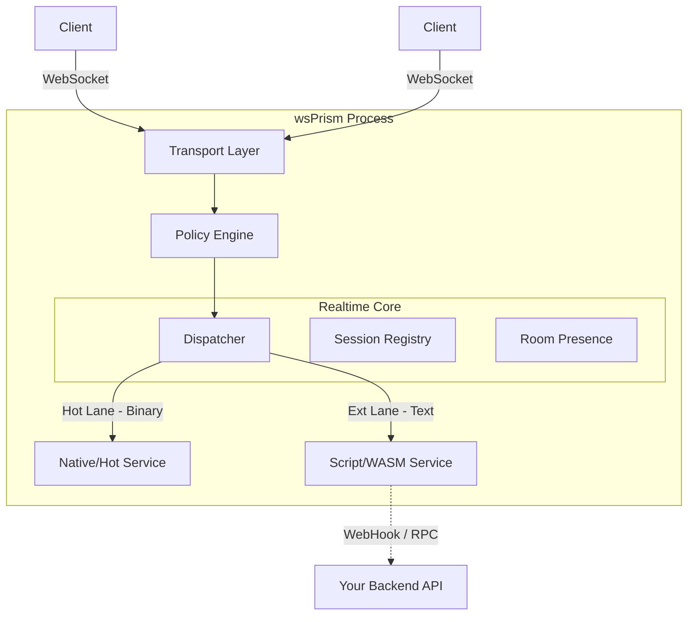

<div align="center">


# wsPrism

**엔터프라이즈급 실시간 게이트웨이**

**웹 소켓 프리즘**

</div>

<p align="center">
  <a href="https://asyncnomad.github.io/wsPrism/">
    
  </a>
  &nbsp;
  <a href="https://asyncnomad.github.io/wsPrism/api/wsprism/index.html">
    
  </a>
</p>

---

## 소개 (Introduction)

   **wsPrism**은 클라이언트(프론트엔드 / 게임 클라이언트)와 비즈니스 로직(백엔드) 사이에 위치하도록 설계된, 고성능 독립형 실시간 게이트웨이입니다. 현대적인 웹 백엔드는 RESTful 요청 처리에는 매우 뛰어나지만, **지속적인 소켓 연결이 요구하는 대규모 동시성, 상태 관리, 그리고 극단적인 저지연 요구 사항**에는 어려움을 겪는 경우가 많습니다.

   **wsPrism은 이러한 문제를, 연결 관리의 모든 부담을 Rust로 구현된 전용 프로세스로 오프로딩함으로써 해결합니다.** wsPrism은 다음과 같은 명확한 철학을 바탕으로 설계되었습니다. **“코어는 빠르고 안전해야 한다(Rust). 그러나 사용성은 보편적이어야 한다.”**

   wsPrism을 사용하기 위해 Rust 전문가일 필요는 없습니다. 이 플랫폼은 멀티플레이 게임, 트레이딩 플랫폼, 실시간 협업 도구 등 다양한 도메인에 적용할 수 있도록 **높은 설정 가능성, 기본 보안, 확장성**을 갖춘 엔터프라이즈급 시스템으로 설계되었습니다.

---

## 빠른 시작 (Quick Start)

### 1. 설정 (Configuration)

wsPrism은 프로젝트 루트의 `wsprism.yaml` 파일을 통해 게이트웨이의 모든 동작을 제어합니다. 운영자는 이 파일을 커스텀함으로써 테넌트별로 완전히 다른 정책을 적용할 수 있습니다. 이를 통해 다음과 같은 것들을 설정할 수 있습니다:

- WebSocket 서버 주소, 핑 주기, 유휴 타임아웃 등 네트워크 동작

- 테넌트(프로젝트) 단위의 격리된 정책

- 초당 메시지 수, 버스트 허용량 등 Rate Limit 전략

- 유저당 동시 접속 수와 초과 시 동작을 정의하는 세션 정책 (1:1 / 1:N)

- 저지연 바이너리 경로(Hot Lane)의 오류 처리 방식과 사용 조건

- 허용된 메시지만 통과시키는 Deny-by-default Allowlist 기반 라우팅

이 방식으로 wsPrism은 게임, 채팅, 협업 툴, 금융 시스템 등 서로 다른 요구사항을 코드 수정 없이 설정만으로 안전하고 일관되게 수용할 수 있습니다.

### 2. 게이트웨이 실행 (Run the Gateway)

Cargo 또는 사전 빌드된 바이너리를 사용해 실행할 수 있습니다.

```bash
# Cargo 사용
RUST_LOG=wsprism_gateway=debug cargo run --release -- --config wsprism.yaml
```

```bash
# 바이너리 사용
./wsprism start --config wsprism.yaml
```

### 3. 실행 확인 (Verify)

서버가 정상적으로 실행되면 다음과 같은 로그가 출력됩니다.

```
INFO  wsprism::server > 🚀 wsPrism Gateway active at 0.0.0.0:8080
INFO  wsprism::loader > Loaded configuration for tenant: "acme"
```

### 4. 연결 (Connect)

클라이언트(브라우저, 게임 엔진 등)에서 WebSocket으로 연결합니다.

- **URL 형식:** `ws://<host>:<port>/v1/ws?tenant=<id>&ticket=<auth_token>`
- **예시:** `ws://localhost:8080/v1/ws?tenant=acme&ticket=dev`

### 5. 메시지 전송 (프로토콜)

wsPrism은 **듀얼 레인(Dual Lane)** 프로토콜을 사용합니다.

### A. Ext Lane (텍스트 / JSON)

채팅, 룸 관리, 복잡한 로직에 사용됩니다.

```json
{
	"v":1,
	"svc":"chat",
	"type":"send",
	"room":"match:1",
	"data":{
		"msg":"Hello World"
	}
}
```

### B. Hot Lane (바이너리)

이동, 물리 연산 등 지연에 민감한 데이터에 사용됩니다.

서비스 ID와 오퍼코드에 의해 엄격하게 라우팅됩니다.

```
구조:[svc_id (u8)][opcode (u8)][flags (u8)][payload ...]
예시:[0x01][0x01][0x00][...bytes...]
```

---

## 설계 철학 (Design Philosophy)

### 1. “사이드카(Sidecar)” 아키텍처

wsPrism은 단순한 라이브러리가 아니라 **실시간 엣지 게이트웨이**입니다.

- 연결 폭주(핸드셰이크, 하트비트, ping/pong)를 처리합니다.
- 수천 개 이상의 상태 기반 동시 세션을 관리합니다.
- 검증되고 허용된 메시지만 서비스로 라우팅합니다.

**결과:**

백엔드 비즈니스 로직은 상태 없는(stateless) 구조를 유지하며 확장성을 확보하고, wsPrism은 저지연 메시지 전달을 보장합니다.

### 2. Rust의 성능 + 인간 친화적 사용성

wsPrism의 코어 엔진은 **Rust**로 구현되어 메모리 안전성, 제로 코스트 추상화, 안정적인 테일 레이턴시를 보장합니다.

그러나 wsPrism은 단순한 엔진이 아니라 **플랫폼**입니다.

- **설정 기반 정책 관리:** 레이트 리미트, 패킷 크기, 허용 목록을 YAML로 제어
- **운영 친화적:** Prometheus 메트릭과 구조화된 로깅을 기본 제공

### 3. “듀얼 레인(Dual Lane)” 프로토콜

대부분의 프레임워크는 “편한 JSON”과 “빠른 바이너리” 중 하나를 강요합니다.

wsPrism은 이 둘을 동시에 지원합니다.

- **Ext Lane (텍스트 / JSON):** 채팅, 로비, 복잡한 데이터 처리용. 디버깅이 쉽고 유연함
- **Hot Lane (바이너리):** 이동, 물리, 시세 틱 처리용. 제로 할당 라우팅, 최소 오버헤드, ID 기반 엄격한 라우팅

---

## 주요 기능 (Key Features)

- **⚡ 초저지연 코어:** `tokio`, `axum` 기반, 락-프리 세션 아키텍처
- **🏢 멀티 테넌시:** 단일 인스턴스에서 여러 프로젝트를 독립 정책으로 운영
- **🛡️ 정책 엔진:** 기본 보안 설계, 테넌트별 허용 목록·레이트 리미트·페이로드 제한
- **🧠 결정적 QoS:** 게임 상태는 손실 허용, 채팅은 신뢰 전달 등 우선순위 기반 전송
- **🔌 전송 계층 독립성:** 비즈니스 로직은 전송 방식과 분리 (현재 WebSocket, 향후 QUIC/TCP)

---

## 아키텍처 개요 (Architecture Overview)

wsPrism은 실시간 인프라의 **트래픽 컨트롤러** 역할을 합니다.



---

## ⚠️ 면책 조항 및 책임 제한 (Disclaimer & Liability)

**반드시 주의 깊게 읽어주세요.**

**wsPrism은 현재 실험적인 개인 프로토타입 프로젝트입니다.**

엔터프라이즈급 아키텍처와 성능을 목표로 설계되었으나, 본 소프트웨어는 **어떠한 형태의 보증도 없이 “있는 그대로(as is)” 제공**됩니다. 여기에는 상품성, 특정 목적 적합성, 비침해에 대한 보증이 포함되며 이에 국한되지 않습니다. 본 소프트웨어를 사용함으로써, 귀하는 다음 사항에 동의하게 됩니다.
1. **자기 책임 하에 사용:** 본 소프트웨어의 사용 또는 재배포 적합성에 대한 책임은 전적으로 사용자에게 있습니다.
2. **책임 부인:** 저작자 또는 권리 보유자는, 본 소프트웨어의 사용 또는 이와 관련하여 발생하는 어떠한 청구, 손해, 책임에 대해서도 책임을 지지 않습니다.
3. **프로덕션 인증 미완료:** 본 소프트웨어는 공식적인 보안 감사나 대규모 프로덕션 환경 검증을 거치지 않았습니다.

프로덕션 환경에서 wsPrism을 사용할 계획이라면, **반드시 자체적인 철저한 테스트와 보안 검토를 수행할 것을 강력히 권장합니다.**

---

## 라이선스 (License)

이 프로젝트는 **Apache License 2.0** 하에 배포됩니다.

자세한 내용은 [LICENSE](https://www.notion.so/LICENSE) 파일을 참고하세요.
