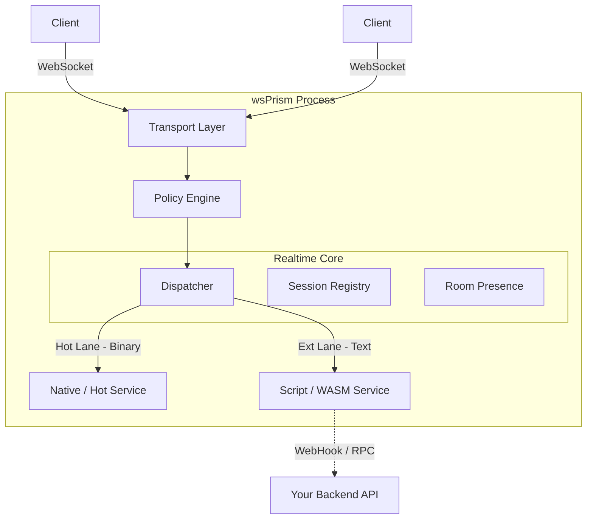

# wsPrism

**The Enterprise-Grade Realtime Gateway**  
**Native Performance. Universal Extensibility.**

---

## Introduction

**wsPrism** is a high-performance, standalone realtime gateway designed to sit between your clients (Frontend / Game Client) and your business logic (Backend).

While modern web backends are excellent at handling RESTful requests, they often struggle with the heavy concurrency, statefulness, and extreme low-latency requirements of persistent socket connections.  
**wsPrism solves this by offloading the heavy lifting of connection management to a dedicated, Rust-powered process.**

We built wsPrism with a specific philosophy:

> **"The core should be fast and safe, but the usage should be universal."**

You do not need to be a Rust expert to use wsPrism.  
It is designed to be an enterprise-grade platform that is **highly configurable**, **secure by default**, and **extensible** to fit any domain—from multiplayer games and trading platforms to live collaborative tools.

---

## Architecture Overview

wsPrism acts as the **traffic controller** for your realtime infrastructure.

---

## Key Features

⚡ **Ultra-Low Latency Core**  
Built on `tokio` and `axum`, utilizing a lock-free, session-oriented architecture optimized for tail latency.

🏢 **Multi-Tenancy**  
Run multiple isolated tenants (projects) on a single wsPrism instance, each with independent configuration and policies.

🛡️ **Policy Engine – Secure by Default**  
Define strict allowlists, rate limits, payload size limits, and behavioral rules per tenant.

🧠 **Deterministic QoS**  
Prioritized message delivery:
- *Lossy* channels for high-frequency game state updates  
- *Reliable* channels for chat, commands, and events

🔌 **Transport Agnostic Design**  
Business logic is fully decoupled from the transport layer:
- WebSocket today  
- QUIC / TCP / Custom transports tomorrow

---

## Disclaimer & Liability

⚠️ **Please Read Carefully**

wsPrism is currently an **experimental, personal prototype project**.

While it is designed with enterprise-grade architecture and performance principles in mind, it is provided **"as is"**, without warranty of any kind, express or implied, including but not limited to:

- Merchantability  
- Fitness for a particular purpose  
- Non-infringement  

By using this software, you acknowledge and agree that:

- **Use at Your Own Risk**  
  You are solely responsible for determining the appropriateness of using or redistributing this software.

- **No Liability**  
  In no event shall the authors or copyright holders be liable for any claim, damages, or other liability, whether in an action of contract, tort, or otherwise, arising from or in connection with the software.

- **Not Production Certified**  
  This software has not yet undergone formal security audits or large-scale production verification.

---

## License

This project is licensed under the **Apache License 2.0**.
